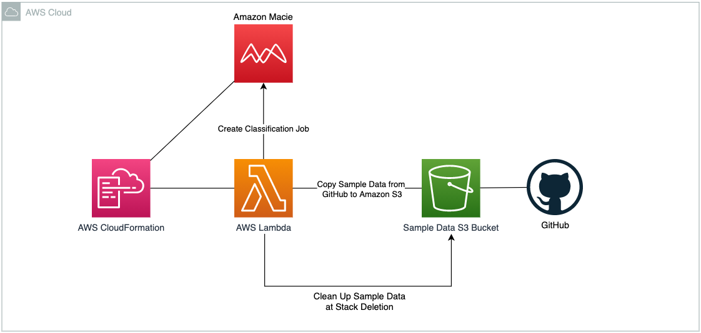

## Amazon Macie Demo with Sample Data
The purpose of this repository is to demo how Data Classification and Discovery works in Amazon Macie.

AWS CloudFormation template (macie.yaml) will enable Amazon Macie and copy the fake data created previously in an Amazon S3 Bucket for its further classification. Also there will be a Custom Classifier to detect classified data in Amazon S3 Bucket.

#### Requirements
Amazon Macie should not be enabled in the region you are launching.

### Architecture


###  Launch the AWS CloudFormation Stack

Click on the **Launch Stack** button below to launch the CloudFormation Stack to set up the Amazon Macie Demo in the region of your preference, by default this demo will be deployed in us-west-2 (Oregon) region.

[](https://us-west-2.console.aws.amazon.com/cloudformation/home?region=us-west-2#/stacks/quickcreate?templateUrl=https%3A%2F%2Famazon-macie-demo.s3-us-west-2.amazonaws.com%2Fmacie.yaml&stackName=amazon-macie-demo)

Provide a stack name eg **amazon-macie-demo**.

You can launch the same stack using the AWS CLI. Here's an example:

```
aws cloudformation create-stack --stack-name amazon-macie-demo \
   --template-body file://macie.yaml \
   --capabilities CAPABILITY_IAM
```

### Amazon Macie Findings
All findings for us-west-2 (Oregon) region can be found [here](https://us-west-2.console.aws.amazon.com/macie/home?region=us-west-2#findings).
Be aware that there is a [Classification Job](https://us-west-2.console.aws.amazon.com/macie/home?region=us-west-2#jobs) running and it will take some time to appear under findings page.

##### Policy Findings to be discovered in this demo - for all Policy Findings please click [here](https://docs.aws.amazon.com/macie/latest/user/findings-types.html#findings-policy-types).
  - Policy:IAMUser/S3BucketPublic
  - Policy:IAMUser/S3BucketSharedExternally
  - Policy:IAMUser/S3BucketEncryptionDisabled
  - Policy:IAMUser/S3BlockPublicAccessDisabled

##### Sensitive Data Findings to be discovered in this demo - for all Sensitive Data Findings please click [here](https://docs.aws.amazon.com/macie/latest/user/findings-types.html#findings-sensitive-data-types)
  - SensitiveData:S3Object/Personal
  - SensitiveData:S3Object/Credentials
  - SensitiveData:S3Object/CustomIdentifier
  - SensitiveData:S3Object/Financial

###  Clean up
After completing your demo, delete AWS CloudFormation Stack using AWS Console or AWS CLI:
```
aws cloudformation delete-stack --stack-name amazon-macie-demo
```

## Security

See [CONTRIBUTING](CONTRIBUTING.md#security-issue-notifications) for more information.

## License

This library is licensed under the MIT-0 License. See the LICENSE file.
